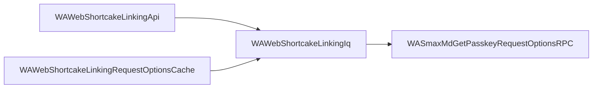

WhatsApp Web's code is scrambled before it ships. One module never mentions another
by name, it refers to it by position (`d[3]`). Searching for usages therefore finds
nothing. The list of connections survives in each module's dependency array, and
`cellar` reverses those arrays while unpacking, so it can answer the question
directly.

```bash
cellar graph WASmaxMdGetPasskeyRequestOptionsRPC --direction dependents --depth 2
```

```
4 nodes, 3 edges  (bundle whatsapp-1044822804, direction dependents)

DEPTH  STATE    DEPS  USED  MODULE
0      ok          7     1  WASmaxMdGetPasskeyRequestOptionsRPC
2      ok         12     4  WAWebShortcakeLinkingApi
1      ok          6     2  WAWebShortcakeLinkingIq
2      ok          4     2  WAWebShortcakeLinkingRequestOptionsCache
```

## Direction

| Direction | Question it answers |
| --- | --- |
| `deps` (default) | What does this module need to work? |
| `dependents` | What breaks if this module changes? |
| `both` | What is the neighbourhood around this module? |

## Choosing the roots

Give module names, a regex, or both. The regex form is how you graph a whole feature
at once.

```bash
cellar graph WAWebSendMsgStanza WAWebReceipt --direction deps
cellar graph --match '^WAWebNewsletter' --direction deps --depth 1
```

## Export formats

### Mermaid

```bash
cellar graph WASmaxMdGetPasskeyRequestOptionsRPC \
  --direction dependents --depth 2 --format mermaid
```

```
flowchart LR
  n0["WASmaxMdGetPasskeyRequestOptionsRPC"]
  n1["WAWebShortcakeLinkingApi"]
  n2["WAWebShortcakeLinkingIq"]
  n3["WAWebShortcakeLinkingRequestOptionsCache"]
  n1 --> n2
  n2 --> n0
  n3 --> n2
```

Paste that into GitHub, Notion, or these docs and it renders:



Arrows always point from the module that depends to the module it depends on,
whichever direction you walked.

### Graphviz

```bash
cellar graph WASmaxMdGetPasskeyRequestOptionsRPC \
  --direction dependents --depth 1 --format dot | dot -Tsvg -o graph.svg
```

```
digraph cellar {
  rankdir=LR;
  node [shape=box, fontname="monospace"];
  "WASmaxMdGetPasskeyRequestOptionsRPC" [label="WASmaxMdGetPasskeyRequestOptionsRPC", style=filled, fillcolor="#cde4ff"];
  "WAWebShortcakeLinkingIq" [label="WAWebShortcakeLinkingIq"];
  "WAWebShortcakeLinkingIq" -> "WASmaxMdGetPasskeyRequestOptionsRPC";
}
```

Roots are shaded. Modules that are referenced but not present in this version are
drawn with a dashed outline, and modules your filter would have excluded are greyed
out.

### JSON

```bash
cellar graph WAWebSendMsgStanza --direction dependents --format json
```

Each node reports its depth from the nearest root, whether it exists in this version,
its total dependency and dependent counts, and its file path.

## Options

| Flag | Meaning |
| --- | --- |
| `--depth N` | Hops from the roots. `0` means unlimited. Default `1`. |
| `--max-nodes N` | Stop after N nodes. Truncation is always reported. |
| `--no-external` | Drop references to modules this version does not contain. |
| `--cycles` | Report dependency cycles found in the collected subgraph. |
| `--filter NAME` | Mark nodes the filter would exclude, without removing them. |

<Note>
  Filtered nodes are marked rather than deleted, because a module you do not care
  about can still be the only link between two you do. The `STATE` column tells you
  which is which.
</Note>
