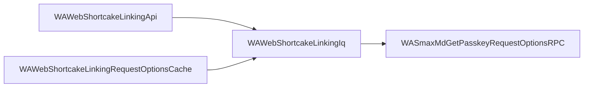

O código do WhatsApp Web é embaralhado antes de ser publicado. Um módulo nunca cita
outro pelo nome, ele referencia por posição (`d[3]`). Buscar por usos, portanto, não
acha nada. A lista de ligações sobrevive no array de dependências de cada módulo, e o
`cellar` inverte esses arrays ao desempacotar, então consegue responder direto.

```bash
cellar graph WASmaxMdGetPasskeyRequestOptionsRPC --direction dependents --depth 2
```

```
4 nodes, 3 edges  (bundle whatsapp-1044822804, direction dependents)

DEPTH  STATE    DEPS  USED  MODULE
0      ok          7     1  WASmaxMdGetPasskeyRequestOptionsRPC
2      ok         12     4  WAWebShortcakeLinkingApi
1      ok          6     2  WAWebShortcakeLinkingIq
2      ok          4     2  WAWebShortcakeLinkingRequestOptionsCache
```

## Direção

| Direção | Pergunta que responde |
| --- | --- |
| `deps` (padrão) | Do que este módulo precisa para funcionar? |
| `dependents` | O que quebra se este módulo mudar? |
| `both` | Como é a vizinhança em volta deste módulo? |

## Escolhendo as raízes

Passe nomes de módulo, uma regex, ou os dois. A forma com regex é como você monta o
grafo de um recurso inteiro de uma vez.

```bash
cellar graph WAWebSendMsgStanza WAWebReceipt --direction deps
cellar graph --match '^WAWebNewsletter' --direction deps --depth 1
```

## Formatos de exportação

### Mermaid

```bash
cellar graph WASmaxMdGetPasskeyRequestOptionsRPC \
  --direction dependents --depth 2 --format mermaid
```

```
flowchart LR
  n0["WASmaxMdGetPasskeyRequestOptionsRPC"]
  n1["WAWebShortcakeLinkingApi"]
  n2["WAWebShortcakeLinkingIq"]
  n3["WAWebShortcakeLinkingRequestOptionsCache"]
  n1 --> n2
  n2 --> n0
  n3 --> n2
```

Cole no GitHub, no Notion ou nesta documentação e ele renderiza:



As setas sempre apontam do módulo que depende para o módulo do qual ele depende,
independentemente da direção que você percorreu.

### Graphviz

```bash
cellar graph WASmaxMdGetPasskeyRequestOptionsRPC \
  --direction dependents --depth 1 --format dot | dot -Tsvg -o grafo.svg
```

```
digraph cellar {
  rankdir=LR;
  node [shape=box, fontname="monospace"];
  "WASmaxMdGetPasskeyRequestOptionsRPC" [label="WASmaxMdGetPasskeyRequestOptionsRPC", style=filled, fillcolor="#cde4ff"];
  "WAWebShortcakeLinkingIq" [label="WAWebShortcakeLinkingIq"];
  "WAWebShortcakeLinkingIq" -> "WASmaxMdGetPasskeyRequestOptionsRPC";
}
```

As raízes ficam preenchidas. Módulos referenciados mas ausentes nesta versão aparecem
com contorno tracejado, e módulos que seu filtro excluiria ficam em cinza.

### JSON

```bash
cellar graph WAWebSendMsgStanza --direction dependents --format json
```

Cada nó informa a distância até a raiz mais próxima, se existe nesta versão, os totais
de dependências e dependentes, e o caminho do arquivo.

## Opções

| Flag | Significado |
| --- | --- |
| `--depth N` | Saltos a partir das raízes. `0` é ilimitado. Padrão `1`. |
| `--max-nodes N` | Para depois de N nós. O corte é sempre informado. |
| `--no-external` | Remove referências a módulos que esta versão não contém. |
| `--cycles` | Informa ciclos de dependência encontrados no subgrafo. |
| `--filter NOME` | Marca os nós que o filtro excluiria, sem removê-los. |

<Note>
  Os nós filtrados são marcados em vez de apagados, porque um módulo que você não
  liga pode ser a única ligação entre dois que você liga. A coluna `STATE` diz qual é
  qual.
</Note>
