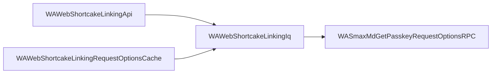

Esta é uma sessão real com dois releases reais do WhatsApp Web. O recurso encontrado é
o login por passkey, que ainda não tinha sido anunciado quando esse código foi
publicado.

## Passo 1: compare os dois releases

```bash
cellar diff whatsapp-1030882912 whatsapp-1044822804 --filter protocol --no-hunks
```

```
whatsapp-1030882912 -> whatsapp-1044822804  (filter `protocol`)
  considered 4711 of 172040 modules (old) / 5269 of 187892 (new)
  added 913 | removed 355 | modified 1515 | unchanged 2841
  suppressed as noise: 41 | diffs skipped for size: 0
```

O release novo tem 187.892 módulos. A maioria pertence ao Facebook e ao Instagram, que
dividem o mesmo bundle. O filtro `protocol` deixa 5.269 que realmente conversam com os
servidores do WhatsApp. Olhando os nomes adicionados, um grupo deles fala de passkeys.

## Passo 2: reduza o escopo

```bash
cellar module search --name 'Passkey' --bundle whatsapp-1044822804
```

```
193 module(s) matched of 193 considered
```

São demais, porque a maioria são telas de login empresarial do Facebook. Coloque o
filtro:

```bash
cellar module search --name 'Passkey' --filter protocol --bundle whatsapp-1044822804
```

```
12 module(s) matched of 12 considered

WASmaxInMdGetPasskeyRequestOptionsResponseError
WASmaxInMdGetPasskeyRequestOptionsResponseSuccess
WASmaxInMdPasskeyPrologueRequestNotificationRequest
WASmaxInMdPasskeyRequestOptionsMixin
WASmaxInMdSetPasskeyPrologueResponseSuccess
WASmaxMdGetPasskeyRequestOptionsRPC
WASmaxMdPasskeyPrologueRequestNotificationRPC
WASmaxMdSetPasskeyPrologueRPC
WASmaxOutMdGetPasskeyRequestOptionsRequest
WASmaxOutMdPasskeyPrologueRequestNotificationResponseAck
…
```

Doze módulos descrevendo uma requisição, uma resposta de sucesso, uma de erro e uma
notificação. Isso é um recurso completo, não uma referência solta.

## Passo 3: leia o código

```bash
cellar module show WASmaxOutMdGetPasskeyRequestOptionsRequest
```

```javascript
__d("WASmaxOutMdGetPasskeyRequestOptionsRequest", [
	"WASmaxJsx",
	"WASmaxOutMdBaseIQGetRequestMixin",
	"WAWap"
], (function(t, n, r, o, a, i, l) {
	function e() {
		var e = o("WASmaxOutMdBaseIQGetRequestMixin").mergeBaseIQGetRequestMixin(o("WASmaxJsx").smax("iq", {
			to: o("WAWap").S_WHATSAPP_NET,
			xmlns: "md"
		}, o("WASmaxJsx").smax("passkey_request_options", null)));
		return e;
	}
	l.makeGetPasskeyRequestOptionsRequest = e;
}), 98);
```

Essa é exatamente a mensagem que o cliente envia:

```xml
<iq to="s.whatsapp.net" type="get" xmlns="md">
  <passkey_request_options/>
</iq>
```

<Note>
  O WhatsApp publica isso em uma única linha enorme. O cellar reformata na hora de
  desempacotar, por isso está legível aqui. Os bytes originais continuam com
  impressão digital guardada, então a comparação entre versões segue exata.
</Note>

## Passo 4: descubra a que isso pertence

O código é embaralhado, então nada cita esse módulo pelo nome e buscar por usos não
encontra nada. O cellar registrou as ligações ao desempacotar:

```bash
cellar graph WASmaxMdGetPasskeyRequestOptionsRPC --direction dependents --depth 2
```

```
4 nodes, 3 edges  (bundle whatsapp-1044822804, direction dependents)

DEPTH  STATE    DEPS  USED  MODULE
0      ok          7     1  WASmaxMdGetPasskeyRequestOptionsRPC
2      ok         12     4  WAWebShortcakeLinkingApi
1      ok          6     2  WAWebShortcakeLinkingIq
2      ok          4     2  WAWebShortcakeLinkingRequestOptionsCache
```



A requisição de passkey é usada pelo código de vínculo de aparelhos. Então não é uma
tela de login. É passkey substituindo o QR code na hora de conectar um novo aparelho.

## O que isso custou

Quatro comandos e cerca de um minuto, sem navegador e sem depurador. Saímos de "algo
mudou neste release" para o formato exato da mensagem e o recurso a que ela pertence.

Peça a mesma coisa ao seu [assistente de IA](/pt-BR/agents) e ele roda esses comandos
sozinho, depois lê os módulos que encontrar.
