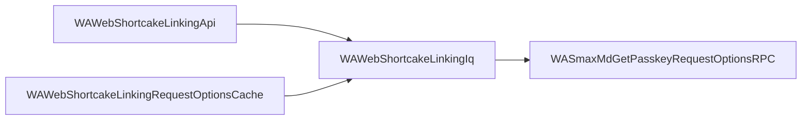

This is a real session against two real WhatsApp Web releases. The feature it finds is
passkey sign-in, which had not been announced when this code shipped.

## Step 1: compare the two releases

```bash
cellar diff whatsapp-1030882912 whatsapp-1044822804 --filter protocol --no-hunks
```

```
whatsapp-1030882912 -> whatsapp-1044822804  (filter `protocol`)
  considered 4711 of 172040 modules (old) / 5269 of 187892 (new)
  added 913 | removed 355 | modified 1515 | unchanged 2841
  suppressed as noise: 41 | diffs skipped for size: 0
```

The newer release has 187,892 modules. Most belong to Facebook and Instagram, which
share the bundle. The `protocol` filter leaves 5,269 that actually talk to WhatsApp's
servers. Scanning the added names, a cluster of them mentions passkeys.

## Step 2: narrow it down

```bash
cellar module search --name 'Passkey' --bundle whatsapp-1044822804
```

```
193 module(s) matched of 193 considered
```

Too many, because most are Facebook's business login screens. Add the filter:

```bash
cellar module search --name 'Passkey' --filter protocol --bundle whatsapp-1044822804
```

```
12 module(s) matched of 12 considered

WASmaxInMdGetPasskeyRequestOptionsResponseError
WASmaxInMdGetPasskeyRequestOptionsResponseSuccess
WASmaxInMdPasskeyPrologueRequestNotificationRequest
WASmaxInMdPasskeyRequestOptionsMixin
WASmaxInMdSetPasskeyPrologueResponseSuccess
WASmaxMdGetPasskeyRequestOptionsRPC
WASmaxMdPasskeyPrologueRequestNotificationRPC
WASmaxMdSetPasskeyPrologueRPC
WASmaxOutMdGetPasskeyRequestOptionsRequest
WASmaxOutMdPasskeyPrologueRequestNotificationResponseAck
…
```

Twelve modules describing a request, a success response, an error response and a
notification. That is a complete feature, not a stray reference.

## Step 3: read the code

```bash
cellar module show WASmaxOutMdGetPasskeyRequestOptionsRequest
```

```javascript
__d("WASmaxOutMdGetPasskeyRequestOptionsRequest", [
	"WASmaxJsx",
	"WASmaxOutMdBaseIQGetRequestMixin",
	"WAWap"
], (function(t, n, r, o, a, i, l) {
	function e() {
		var e = o("WASmaxOutMdBaseIQGetRequestMixin").mergeBaseIQGetRequestMixin(o("WASmaxJsx").smax("iq", {
			to: o("WAWap").S_WHATSAPP_NET,
			xmlns: "md"
		}, o("WASmaxJsx").smax("passkey_request_options", null)));
		return e;
	}
	l.makeGetPasskeyRequestOptionsRequest = e;
}), 98);
```

That is the exact message the client sends:

```xml
<iq to="s.whatsapp.net" type="get" xmlns="md">
  <passkey_request_options/>
</iq>
```

<Note>
  WhatsApp ships this on one very long line. cellar reformats while unpacking, which
  is why it is readable here. The original bytes are still fingerprinted, so
  comparisons between versions stay exact.
</Note>

## Step 4: find out what it belongs to

The code is scrambled, so nothing mentions this module by name and searching for
usages finds nothing. cellar recorded the connections while unpacking:

```bash
cellar graph WASmaxMdGetPasskeyRequestOptionsRPC --direction dependents --depth 2
```

```
4 nodes, 3 edges  (bundle whatsapp-1044822804, direction dependents)

DEPTH  STATE    DEPS  USED  MODULE
0      ok          7     1  WASmaxMdGetPasskeyRequestOptionsRPC
2      ok         12     4  WAWebShortcakeLinkingApi
1      ok          6     2  WAWebShortcakeLinkingIq
2      ok          4     2  WAWebShortcakeLinkingRequestOptionsCache
```



The passkey request is used by the device linking code. So this is not a login screen.
It is passkeys replacing the QR code when you link a new device.

## What that took

Four commands and about a minute, with no browser and no debugger. We went from
"something changed in this release" to the exact message format and the feature it
belongs to.

Ask your [AI assistant](/agents) to do the same thing and it will run these commands
itself, then read the modules it finds.
